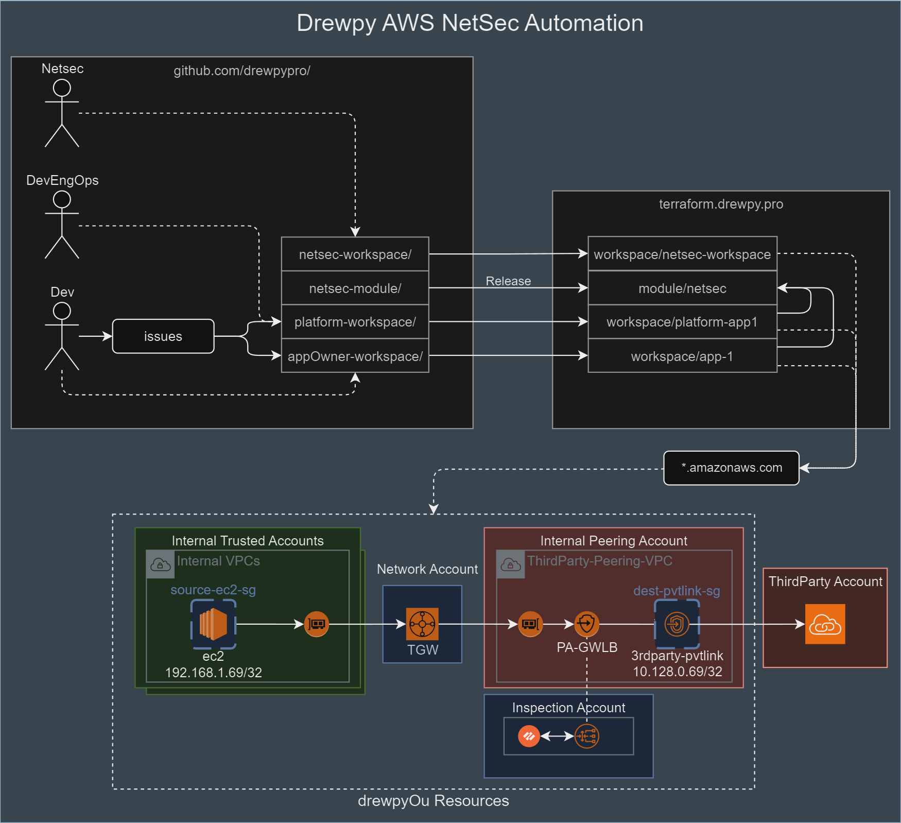
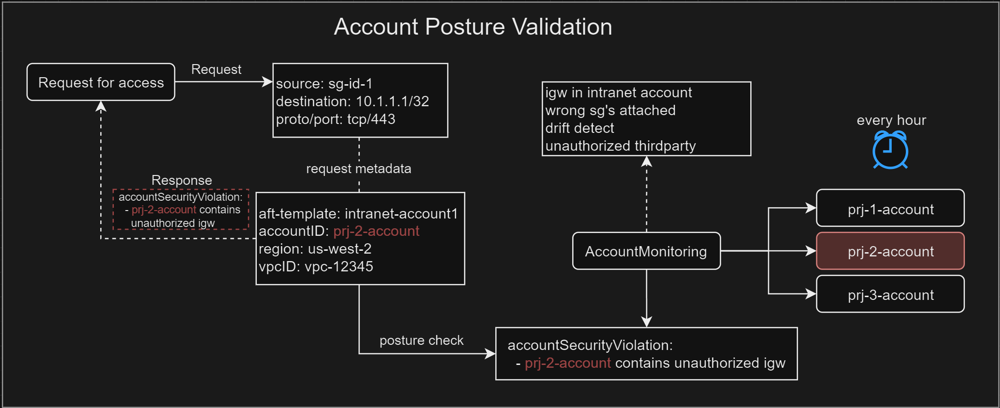

# terraform-aws-netsec-automation

- Define and test end to end access request and netsec automation solution
- Understand different methods of vending aws resources with dependencies based on RACI.

# Goals
- This project automates end-to-end network security access control across AWS security groups and Palo Alto firewalls.
- It enables developers to request network access declaratively through GitHub Issues, while network security policies are dynamically generated, validated, and enforced across multi-account AWS infrastructure.
- Access is only granted if the requesting accounts meet security posture requirements, traffic patterns are classified correctly, and all necessary security control points are updated.

# Repo Structure
    terraform-aws-netsec-automation/
    ├── img/
    ├── infrastructure/
    │   ├── palo/
    │   │   ├── pan.tf
    │   │   ├── variables.tf
    │   ├── policies/
    │   │   ├── app-1.yaml
    │   │   ├── app-2.yaml
    │   │   ├── 3rdparty1-pvtlink1.yaml
    │   │   ├── 3rdparty2-pvtlink1.yaml
    │   ├── locals.tf
    │   ├── main.tf
    │   ├── palo.tf
    │   ├── sg.tf
    │   ├── variables.tf
    ├── README.MD


# Prerequisites
- github
- terraform
- pan-os firewalls
- panorama
- AWS IAM permissions
- money


## Personas
- **Netsec Dev** 
    - Responsible for network security controls including aws security-groups, gwlb and palo alto.
    - Responsible for network segmentation including subnets and route table configurations.
- **Platform Dev** 
    - Responsible for vending account resources on behalf of requesting app dev. 
- **App Dev** 
    - Responsible for developing an application and for providing requirements for network access. 

## Requirements
- **Dev Requirements**
    - Needs to be easy to use and leverage existing dev toolsets.
    - Requirements to operate in pipeline must be well documented.
    - Feedback must be provided immediately.
- **Platform Dev Requirements**
    - Desires end to end functionality to drive enablement and implementation through declaration.
    - Account vending must not take longer than 1 hour. 
    - App pipeline must not take longer than 1 hour.
    - Platform teams manage platforms separate from app DX.
    - Provide unified platform front-end for DX. 
    - Everything must be automated with as little friction as possible in a single pipeline if possible.
    - Leverage AFT to manage templates.
    - Automatic failover to separate availability zone or regions must be supported. 
- **Security Requirements**
    - IAM
        - Access to unauthorized destination AWS resources is denied. 
        - Access from unauthorized AWS principals to trusted assets is denied.
        - Unauthenticated services and resources are restricted. 
        - Separate Production and Dev assets and services.
        - Resources must be segmented into accounts based on use-case. 
        - Accounts must be segmented by use-case and placed in OU. 
    - VPC Network Connectivity
        - AWS Security-groups and Palo Alto firewall policy must be leverage micro-segmentation where possible.
        - Dataflow information provided needs to be accurate and must be validated before automating access.
        - Templated access can be fully automated however metadata mapping is required and if not available, must be manually reviewed.
        - Direct Internet access is restricted, elastic-IP's and public gateways are restricted. 
        - Some access must always require manual review before implementation.
        - Separate Production and Dev assets and services.
        - Authorized external connectivity must be restricted to specific registered IP space and reviewed quarterly.
        - Authorized external connectivity through private peering or API backplane must be restricted to specific account, region and permissions/methods. 
        - Access permitted through major boundaries via the VPC network or API must support automated remediation if suspected compromise.
        - All access must be declared and automated with as little friction as possible but require manual review/approvals and escalation where necessary.
        - All network activity must be logged and stored.
        - Unauthorized tunneling is prohibited. 
        - All network connections must support encryption and authentication.
    - API Backplane Connectivity
        - External messaging must go through authorized gateways and domains must be authorized by Information Security.
        - Unauthorized tunneling is prohibited. 
    - Thirdparty
        - Staging accounts are leveraged to segment thirdparty access to trusted storage to support gated access.
        - Thirdparty managed compute must be isolated from internal networks and requires deep packet inspection and isolated permissions and access for all connectivity. 
    - Internet
        - Ingress internet must go through public waf and bot mitigation infrastructure. 
    - Remote Access
        - Direct access from user laptops to cloud infrastructure is restricted. 
    - Encryption
        - All data and volumes at rest must be encrypted. 
        - All network connectivity must be encrypted. 
    - Monitoring
        - Security alerts must be generated and requires response within time-constraints based on severity. 
    - Secure Configuration of resources
        - All resources must be created by authorized svcAccounts through Terraform and Sentinel.
        - Platform repos must be monitored and require PRs with strict approval requirements.
        - External packages, images and artifacts must be retrieved through internal pipelines that monitor and prevent malicious supply chain activity.
        - Network Security Code Ownership of repo or templates that leverage svcAccounts that have permissions to create rules. 
        - Vending pipeline must initiate from trusted IP addresses used as conditions in assume-role policy.
        - Unauthorized configurations are monitored and automatically remediated if not prevented. 
    - Data Protection
    - API Security
        - All API activity must be logged and stored.
    - Threat Detect/Prevent
        - Every bit of untrusted data or access from untrusted principals must be inspected to provide detection and prevention requirements everywhere possible.
        - Connectivity through data boundaries must be identified and inspected based on(where possible):
            - **URL**: HTTP/TLS access must be restricted to specific domains/subdomains. 
            - **AppID**: Protocol decoders enforce authorized application(ssl/tls) and deny all else (bittorrent,ssh,etc.)
        - These threats must be identified, alerted and/or prevented: 
            - **Antivirus**: Detect and prevent malicious files based on known malicious filehash. 
            - **Vulnerability**: Detect and prevent vulnerabilities from being exploited. 
            - **Spyware**: Detect and prevent c2c, bonet activity. 
            - **ZeroDay**: Detonate files and process data in a sandbox to detect zero day vulnerabilities. 
            - **DLP**: Detect and prevent data and content in files and connections based on pattern matching.
            - **DoS/Flood Protection**: Detect and Prevent resource exhaustion attacks.
            - **Packet Based Attack Protection**: Detect and prevent various malicious ip headers. 
    - **Exceptions to the rules above must be reviewed quarterly and remedation owner must be identified.**

## Architecture
- **CI/CD**
    - Platform teams manage TF templates for account and network vending. 
    - Git Issues trigger platform vending.
    - App teams trigger app vending.
    - Private github repos call terraform pipeline. 
    - Terraform pipeline leverages TF Sentinel to restrict actions. 
- **CloudSec**
    - OUs/SCPs are defined.
    - Create boundaries around services within the OU where possible.
    - Terraform Sentinel enforces security policy on terraform runs.
    - Each service must be declared, reviewed and certified for use in production. 
- **AWS IAM**
    - root account must be disabled
    - svcAccount that is only allowed to assume a specific role with limited permissions in a specific account. 
    - assume-role policy that trusts specific principals. 
    - role permissions that are restricted to each roles requirements. (app, platform, netsec)
- **AWS Networking**
    - AWS Internal Private VPCs with restricted internet connectivity. 
    - Route tables segment private and public default routes. 
        - Internet default route is limited to external security gateways and proxys
        - Intranet default route is pointed to the TGW for more specific routing. 
    - TGW connects internal networks by environment/region. 
    - RFC1918 is used to route between vpc's across the tgw. 
    - Dual-stack IPv6 is desirable to prevent IP exhaustion but not implemented yet due to complexity and lack of testing. 
    - RFC1918 IPv4 space exhaustion can leverage nat gateways but is highly undesirable due to costs and security enforcement/visibility complexity.
- **AWS Network Security**
    - Permissions for security-groups are restricted to authorized principals. 
    - Each resource must have a dedicated security-group
    - Platform services like eks and lambda must have a dedicated security-group per cluster/function.
    - All Platform managed aws security-groups must be restricted. 
    - Each eni must only support 1 or 2 security-groups to maximize rule quotas per group. 
    - Quotas in each account must be automatically set as high as possible. 
    - AWS Service access must go through AWS Privatelink VPC-Endpoints and Gateway endpoints where possible. 
    - VPC-Endpoint Policy must restrict source and destination principals to org or ou-path for all services where possible.
    - Internet access must go through authorized security controls (proxys, firewalls, gateways, etc.)
    - All access being requested must have proper justification that matches intent of the declared access.
    - Access must be granted to most specific source and destination to reduce possible network access to authorized destinations only. 

# Problems
- **Problem1**: IP addresses aren't known at time of TF Run. 
    - Network Security controls require IP addresses to segment access across the network.
    - When platform/app devs create resources through terraform they typically require an aws security-group to be present or created at time of resource instantiation. 
    - It makes most sense in a developer pipeline to vend security-groups within the terraform run. 
    - Network Security cannot derive enough metadata to create a full end to end policy. 
    - Bad, because a separate firewall access request is required outside of the pipeline to accomodate. 
    - Dev friendly solutions are typically undesirable as security code is no under the control of the repo owner. 
        - Now additional effort is required to play cat/mouse with various policy gatekeepers. 
        - Also is only checked at time of run, some security controls require dynamic updates which must happen outside of pipeline.
    - Solutions: 
        - **Option1**: Create IP allocator terraform function that assigns and allocates IP addresses that are applied to ENI's vended to AWS resources. 
            - Pros: Pre-allocate IPs at runtime and use for populating security policy. 
            - Cons: Specific IPs and eni's are possible for some services and others require subnet level definition. 
        - **Option2**: Create empty security-group and trigger separate call to build resources. 
            - Pros: Specific SG-ID can be supplied, validated and tracked in external asset inventory. 
            - Cons: Some services require access for build to be successful (eks for example)
        - **Option3**: Leverage TF Modules managed by Netsec team and called by Dev team. 
            - Pros: Scales very well. 
            - Cons: Not granular enough and managing TF applys in many customer workspaces sucks. 
    - Resources may be created manually or in separate pipelines (platform,app) and increases complexity orchestrating security policy independently and idempotently. 
    - Pre-built infrastructure accounts
        - Network
        - Inspection
        - Peering
    - Dynamically created app accounts. 
        - app-1
        - app-2
    - Challenges:
        - Every new resource needs real-time updates
            - Source AWS Security-Group Egress Rules
            - Middle PaloAlto security policies
            - Destination AWS Security-Group Ingress rules
        - Security updates must happen at build time and when resources are created. 
        - Drift between all controls from source to destination may break connectivity. 
        - Scaling is a challenge. 
        - AppID and url category is may not be known or provided by the requestor. 
            - Netsec may require these to be included for a given request. 
            - Create way to insert appid and/or url category during the PR phase of the request. 
                - dev submits request without url category or appid. 
                - netsec arch/engineer manually adds app-id/url-category or approves the request without them provided an exception is stated. 
    - Solutions: 
        - Track Desired State per Resource:
            - e.g., "Resource A needs flow to Resource B through TGW/FW/Privatelink — current status = pending/missing at destination."
        - Event-Driven Triggers:
            - Resource creation events trigger update pipelines that attempt to update each control plane.
        - Retry / Queueing Mechanisms:
            - If destination is not ready yet, queue the policy request and retry later.
        - Asset Inventory Sync:
           - Maintain a lightweight inventory that maps resources, their metadata (tags, IPs, SG IDs), and policy states.

| Account Category | Account Characteristics |
|---|---|
|ThirdParty Account/VPC |- Platform-built (standardized)|
| |- Few accounts|
| |- Built ahead of time|
| |- Easier to automate security controls early|
|Network/Inspection Core Accounts |- Platform-built|
| |- Core infra (TGW, GWLB, Palo Alto, Privatelinks)|
| |- Pre-existing or being replatformed|
| |- Controlled change windows|
|App-Driven Internal Accounts |- Dynamic |
| |- Built at different times (legacy, new, iterative expansion) |
| |- Different levels of maturity (IAM hygiene, tagging, VPC design) |
| |- Different teams owning VPCs and deployments |
| |- Devs may not care about network control points (only app function) |
|Legacy vs New Iterations |- Legacy accounts may lack tagging, metadata, usable structure |
| |- First-gen accounts may follow inconsistent early standards |
| |- Newer accounts may adopt your new platform-driven templates (if you succeed) |


|Area | Problem |
|---|---|
| Timing | Can't control when accounts/resources are built. |
| Ownership | Different teams own network vs app vs platform pipelines. |
| Trust | Platform and App teams are not always trustworthy about network access controls. |
| Consistency | Legacy accounts have inconsistent structure (bad tags, bad naming, bad VPC segmentation). |
| Visibility | Hard to know when new VPCs, ENIs, or PrivateLinks appear dynamically. |
| Security Drift | If Devs self-manage network/security, your central platform can drift from reality. |
| Interruption Risk | Inserting automation mid-stream risks breaking existing app flows if not done carefully. |
| Scaling | If automation requires manual review every time, you can't scale across hundreds of accounts. |

# Account Metadata Collection
- Collect this metadata and store it for policy decisions. 
    | Data | Why it's needed |
    |---|---|
    | AccountID | Distinguish accounts (Source vs Destination) |
    | Region | Enforce regionality rules (e.g., intra-region vs cross-region) |
    | VPC ID | Distinguish if same/different VPC; used for intra-vpc vs inter-vpc validation |
    | VPC Cidr | Validate subnets and deny requests to full cidr if declared |
    | Subnet ID | Helps validate correct zoning (public, private, isolated) |
    | ENI (Elastic Network Interface) | Directly map deployed resources to security groups and IPs |
    | Security Group ID | Validate SG rules, memberships, gaps, potential conflicts |
    | Tags | Absolutely critical for ownership, environment (prod/dev), application identity, sensitivity classification |
    | Route Tables (optional) | Helpful for understanding network paths and enforcement boundaries (later) |
    | Privatelink Endpoints (optional) | Identify external/internal exposure points (later) |


# Account Posturing

- Enabling access for resources in accounts with security misconfigurations may create unacceptable risk. 
- At time of access requests, account may identified security vulnerabilites. 
- Create a validation gate that denies requests to accounts with unforgivable security misconfigurations. 
- Run a validator process that confirms configuration state and update report. 
- When access request is submitted, validate status of account in report prior to continuing to the next step. 
- Account status types:
    - Critical = Auto-Deny
    - Major = Require Manual Approval or Remediation
    - Minor = Allow with Warning, monitor


# Connectivity Pattern Classifier
- Thirdparty
- Intra-VPC
- Inter-VPC
- Cross-Environment
- Campus
- Cross-Cloud
- Cross-DC
- Private DC


# Valid Connectivity Patterns
| source | destination | security-control | requirement | 
| --- | --- | --- | --- | 
| eks-app-pods | aws-service-privatelink | security-group, vpc-endpoint policy |  | 

# Sample Requests


## Context
- ClientAccount1:
    - VPC - 192.168.0.0/22
        | subnet-name | cidr | description | 
        | --- | --- | --- |
        | general-compute | 192.168.1.0/24 | ec2, lambdas, rds, eks-cluster-endpoint | 
        | eks-nodes | 192.168.2.0/25 | eks worker nodes only | 
        | aws-vpc-endpoints | 100.66.0.0/25 | aws services via privatelink endpoints |
        | tgw | 100.67.0.0/25 | transit gateway eni's only |
        | public-nat | 100.65.0.0/28 | nat-gateway | 
        | egress-gwlb-vpce | 100.65.16.0/28 | egress-gwlb-vpce | 
        | igw | n/a | igw edge association |
    - Route Tables
        | route-table | subnets | routes | 
        | --- | --- | --- |
        | tgw-rt | tgw | n/a |
        | core-rt | general-compute, eks-nodes, aws-vpc-endpoints | 0.0.0.0/0 -> public-nat-gtw-id</br>10.0.0.0/8->tgw-id</br>192.168.0.0/16->tgw-id | 
        | nat-gwy-rt | public-nat | 0.0.0.0/0->egress-gwlb-vpce-id | 
        | egress-gwlb-rt | egress-gwlb-vpce | 0.0.0.0/0->igw |
        | igw | n/a | igw edge association | 100.64.0.0/28 -> egress-gwlb-vpce-id |
- Inspection Account:
    - VPC - 10.0.0.0/22
        | subnet-name | cidr | description | 
        | --- | --- | --- |
        | gwlb-dataplane | 100.64.0.0/25 | palo-dataplane-enis, gwlb-dataplane-enis, egress-gwlb-vpce |
        | public-subnets | 100.65.0.0/27 | palo-egress-enis, palo-egress-mgmt-eni |
        | infra-mgmt | 10.0.0.0/24 | palo-mgmt-eni |
        | aws-vpc-endpoints | 100.66.0.0/25 | aws services via privatelink endpoints |
        | tgw | 100.67.0.0/25 | transit gateway eni's only |
    - Route Tables
        | route-table | subnets | routes | 
        | --- | --- | --- |
        | tgw-rt | tgw | n/a |
        | core-rt | gwlb-dataplane, infra-mgmt, aws-vpc-endpoints | 0.0.0.0/0->egress-gwlb-vpce-id</br>10.0.0.0/8->tgw-id</br>192.168.0.0/16->tgw-id |
        | public-rt | public-subnets | 0.0.0.0/0->igw |
- Network Account: 
    - TGW
- Peering Account: 
    - VPC - 10.128.0.0/22
        | subnet-name | cidr | description | 
        | --- | --- | --- |
        | tgw | 100.67.0.0/25 | transit gateway eni's only |
        | thirdparty-gwlb-vpce | 100.64.0.0/25 | thirdparty-gwlb-vpce |
        | 3rdparty-vpce | 10.128.0.0/24 | 3rdparty-pvtlink-vpce |
        | producer-frontend | 10.129.0.0/24 | load-balancers and gateways exposing internal services to thirdpartys |
    - Route Tables
        | route-table | subnets | routes | 
        | --- | --- | --- |
        | tgw-rt | tgw | 10.128.0.0/23->thirdparty-gwlb-vpce-id |
        | 3rdparty-gwlb-rt | thirdparty-gwlb-vpce | 0.0.0.0->tgw-id |
        | 3rdparty-peering-rt | producer-frontend, 3rdparty-vpce | 0.0.0.0/0->thirdparty-gwlb-vpce-id |
    ```
    New Access Request ->
    |
    v
    SourceAccount == DestinationAccount?
    Yes --> Intra-VPC or Inter-VPC?
        - Same VPC -> Intra-VPC
        - Different VPC -> Inter-VPC
    No --> Is DestinationAccount a Thirdparty Account?
        - Yes -> Thirdparty Traffic (requires Firewall, SG updates)
        - No -> Inter-Account (requires SG updates, maybe TGW)

    Then: Based on classification, apply control plane updates.
    ```
# Request ingestion
1. Parse input
2. Validate metadata
3. Classify access and decide if firewall configuration is required. 
4. Implement rules automatically or based on manual approval if required. 


# Validation

## Check AWS Config per request
1. Extract SourceAccount, DestinationAccount from Issue
2. Query AWS Config:
   a. Get Source SG metadata
   b. Get Destination SG metadata
   c. (Optionally) Get ENIs attached
   d. (Optionally) Get Subnets if needed
3. Validate Resource State:
   a. Exists? (If not, deny request)
   b. Tagged correctly? (If not, deny or warn)
   c. Belongs to correct account/env? (If not, deny)
4. Enrich Access Request Context
5. Classify Traffic Type (Thirdparty? Intra-VPC? Inter-VPC?)
6. Generate Terraform Plan
7. Apply or Deny based on Policy

## Scenario1:
- Client, Network, Inspection and peering accounts and infrastructure are already pre-built. 
- Assumes developers know their requirements including app-id and url's. 
- Assumes source/destination security-groups are already built but ingress/egress rules are empty. 
- Assumes PaloAlto has no policy written as well. 
- Requestors are now using github issues to request new firewall access.
- **Request1**: 
    - Business justification: Need to connect EC2 to the thirdparty1-pvtlink-vpce for business function Y.
    - SourceAccount: prj-1-account
    - SourceSGID: sg-id-12345
    - Source: 192.168.1.69/32
    - DestinationAccount: thirdparty-peering
    - DestinationSGID: sg-id-4567
    - Destination: 10.128.0.69/32
    - Proto/Port: tcp/443
    - URL: app.thirdparty1.com
    - appID: SSL/TLS
- **Request2**: 
    - Business justification: Need to connect aws service vpc-endpoints for control plane connectivity. 
    - SourceAccount: prj-1-account
    - SourceSGID: sg-id-12345
    - Source: 192.168.1.69/32
    - DestinationAccount: prj-1-account
    - Destination: 100.66.0.2/32
    - DestinationSGID: sg-id-12345
    - Proto/Port: tcp/443
    - URL: ec2.amazonaws.com
    - appID: SSL/TLS
- **Request3**: 
    - Business justification: EKS nodes need connectivity to the thirdparty2-pvtlink-vpce for business function Y.
    - Source: 192.168.2.69/32
    - Destination: 10.128.0.89/32
    - Proto/Port: tcp/27017
    - URL: mongodb.thirdparty2.com
    - appID: mongodb
- Github Issues takes input and formats the input for:
    - Source AWS Security-group Egress rule
        - Metadata used for policy:
    - Intermediary Palo Alto firewall rule
    - Destination AWS Security-group Ingress rule
