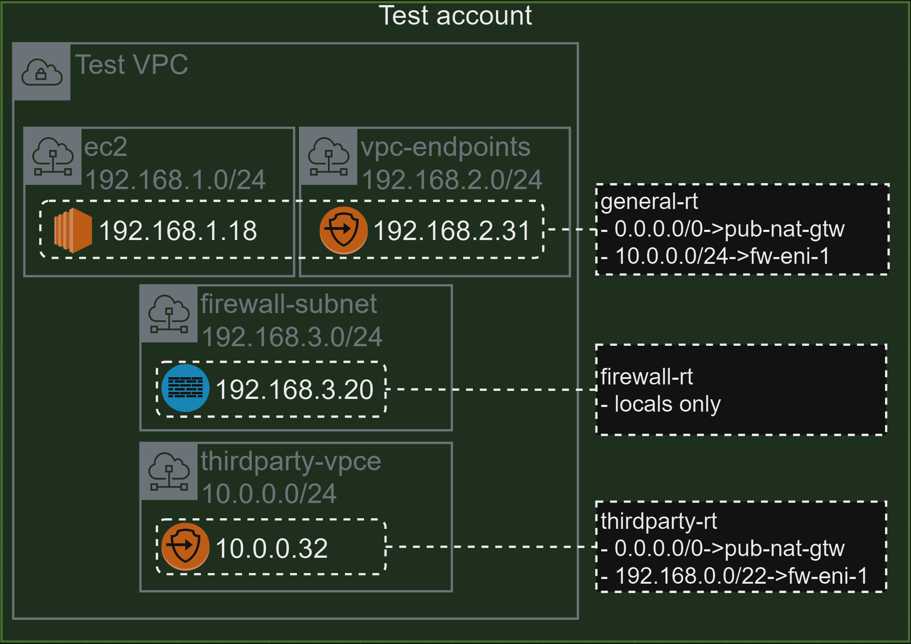

# terraform infrastructure


```yaml
request_id: req-20240428-xyz
submitted_by: <derived automatically>
submitted_at: <derived automatically>

overall_business_justification: >
  Overall business justification for all requests below (required)

requests:
  - business_justification: >
      Per request business justification (required)
    source:
      account_id: (optional)
      vpc_id: (optional)
      region: (optional)
      security_group_ids: <must be specific id, optional when ips are called>
      ips: [list of IP's, optional when security_group_ids are called]
    destination:
      account_id: (optional)
      vpc_id: (optional)
      region: (optional)
      security_group_ids: <must be specific id, optional when ips are called>
      ips: [list of IP's, optional when security_group_ids are called]
    proto: <tcp|udp|icmp|any> (required, only one)
    port: <1-65535> (required, can be range or single port )
    appid: ssl (optional)
    url:  (optional)
```
