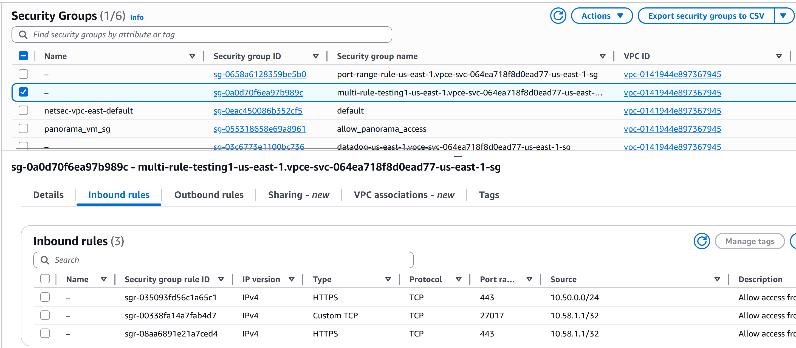
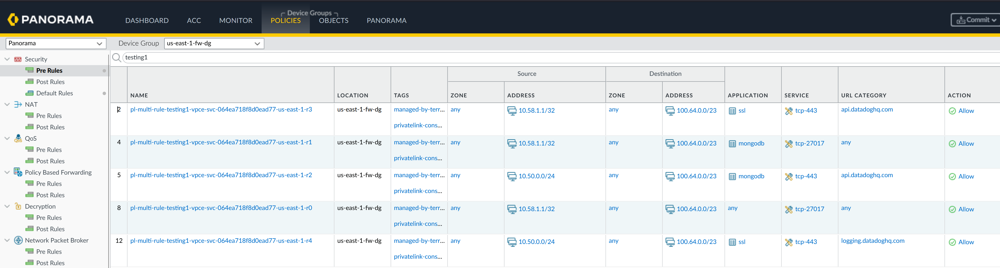
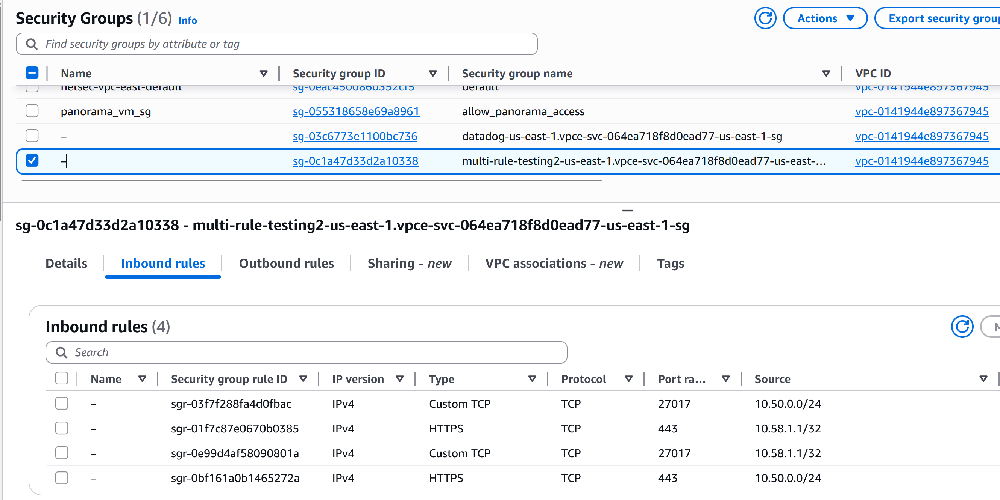
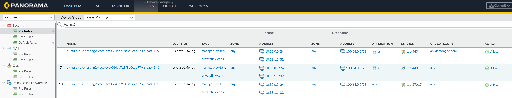
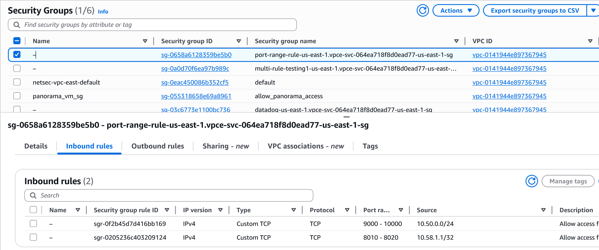
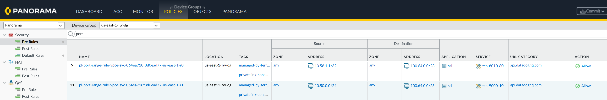
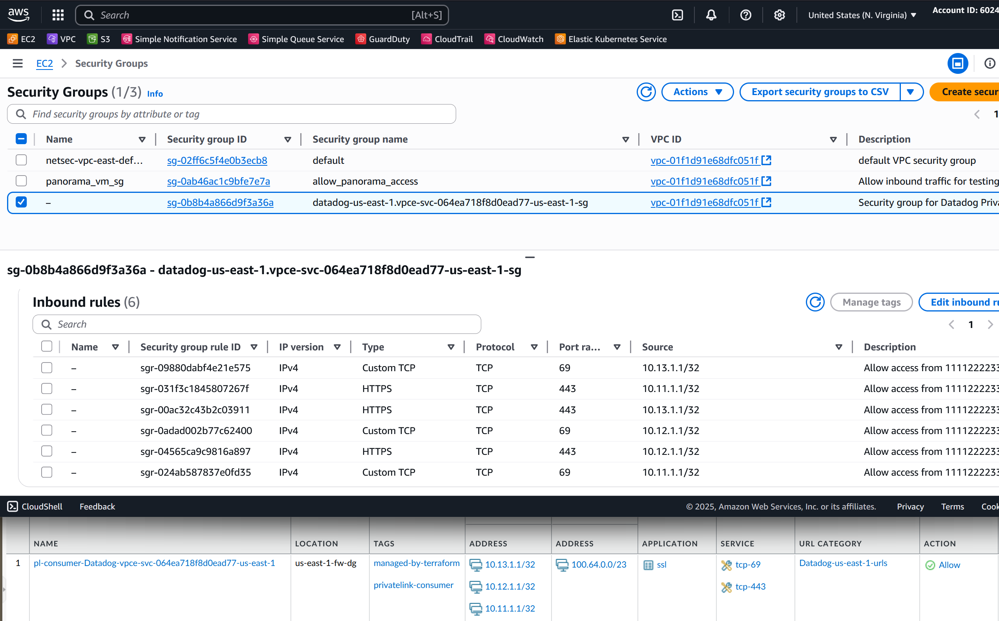

# [V2.2](https://github.com/drewpypro/terraform-aws-netsec-automation/tree/v2.2) testing
## Multi-Rule-Testing1 Request
```yaml
security_group:
  request_id: RQ-001
  business_justification: >
    Create security-group for datadog API us-east-1 privatelink in us-east-1
  accountId: 6666666
  region: us-east-1
  vpc_id: vpc-0141944e897367945
  serviceType: privatelink-consumer
  serviceName: com.amazonaws.vpce.us-east-1.vpce-svc-064ea718f8d0ead77
  thirdpartyName: multi-rule-testing1
  thirdPartyID: 123456
rules:
  - request_id: RQ-001
    business_justification: >
        Create access from acct-1 intranet nat gateway to datadog api vpc-endpoint. 
    source:
      account_id: 111122223333
      vpc_id: vpc-aaa
      region: us-east-1
      ips:
        - 10.50.0.0/24
    protocol: tcp
    port: 443
    appid: mongodb
    url: https://api.datadoghq.com
    enable_palo_inspection: true
  - request_id: RQ-002
    business_justification: >
        Create access from acct-1 intranet nat gateway to datadog api vpc-endpoint. 
    source:
      account_id: 111122223333
      vpc_id: vpc-aaa
      region: us-east-1
      ips:
        - 10.58.1.1/32
    protocol: tcp
    port: 443
    appid: ssl
    url: https://api.datadoghq.com
    enable_palo_inspection: true
  - request_id: RQ-004454
    business_justification: >
        Create access from acct-1 intranet nat gateway to datadog api vpc-endpoint. 
    source:
      account_id: 111122223333
      vpc_id: vpc-aaa
      region: us-east-1
      ips:
        - 10.50.0.0/24
    protocol: tcp
    port: 443
    appid: ssl
    url: https://logging.datadoghq.com
    enable_palo_inspection: true
  - request_id: RQ-002
    business_justification: >
        Create access from acct-1 intranet nat gateway to datadog api vpc-endpoint. 
    source:
      account_id: 111122223333
      vpc_id: vpc-aaa
      region: us-east-1
      ips:
        - 10.58.1.1/32
    protocol: tcp
    port: 27017
    appid: mongodb
    url: 
    enable_palo_inspection: true
  - request_id: RQ-002
    business_justification: >
        Create access from acct-1 intranet nat gateway to datadog api vpc-endpoint. 
    source:
      account_id: 111122223333
      vpc_id: vpc-aaa
      region: us-east-1
      ips:
        - 10.58.1.1/32
    protocol: tcp
    port: 27017
    appid:
    url: 
    enable_palo_inspection: true
```

## Multi-Rule-Testing1 Output
- AWS SG (cannot support dupes, list is accepted but still writes rules as cidr, proto, port)
    
    - #source_cidr, proto/port
    1. 10.50.0.0/24, tcp/443
    2. 10.58.1.1/32, tcp/443
    3. 10.58.1.1/32, tcp/27017
- Palo rules (separate by proto/port, appid (if null, then any) and url-category-object (if null, then any))
    
    - #source_cidr, proto/port, appid, url
    1. 10.50.0.0/24, tcp/443, mongodb, api.datadoghq.com
    2. 10.58.1.1/32, tcp/443, ssl, api.datadoghq.com
    3. 10.50.0.0/24, tcp/443, ssl, logging.datadoghq.com
    4. 10.58.1.1/32, tcp/27017, mongodb, any
    5. 10.58.1.1/32, tcp/27017, any, any


## Multi-Rule-Testing2 Request
```yaml
security_group:
  request_id: RQ-001
  business_justification: >
    Create security-group for datadog API us-east-1 privatelink in us-east-1
  accountId: 6666666
  region: us-east-1
  vpc_id: vpc-0141944e897367945
  serviceType: privatelink-consumer
  serviceName: com.amazonaws.vpce.us-east-1.vpce-svc-064ea718f8d0ead77
  thirdpartyName: multi-rule-testing2
  thirdPartyID: 123456
rules:
  - request_id: RQ-001
    business_justification: >
        Create access from acct-1 intranet nat gateway to datadog api vpc-endpoint. 
    source:
      account_id: 111122223333
      vpc_id: vpc-aaa
      region: us-east-1
      ips:
        - 10.50.0.0/24
    protocol: tcp
    port: 443
    appid: ssl
    url: https://api.datadoghq.com
    enable_palo_inspection: true
  - request_id: RQ-002
    business_justification: >
        Create access from acct-1 intranet nat gateway to datadog api vpc-endpoint. 
    source:
      account_id: 111122223333
      vpc_id: vpc-aaa
      region: us-east-1
      ips:
        - 10.58.1.1/32
    protocol: tcp
    port: 443
    appid: ssl
    url: https://api.datadoghq.com
    enable_palo_inspection: true
  - request_id: RQ-004454
    business_justification: >
        Create access from acct-1 intranet nat gateway to datadog api vpc-endpoint. 
    source:
      account_id: 111122223333
      vpc_id: vpc-aaa
      region: us-east-1
      ips:
        - 10.50.0.0/24
    protocol: tcp
    port: 27017
    appid: 
    url: 
    enable_palo_inspection: true
  - request_id: RQ-002
    business_justification: >
        Create access from acct-1 intranet nat gateway to datadog api vpc-endpoint. 
    source:
      account_id: 111122223333
      vpc_id: vpc-aaa
      region: us-east-1
      ips:
        - 10.58.1.1/32
    protocol: tcp
    port: 27017
    appid: 
    url:  
    enable_palo_inspection: true
  - request_id: RQ-004454
    business_justification: >
        Create access from acct-1 intranet nat gateway to datadog api vpc-endpoint. 
    source:
      account_id: 111122223333
      vpc_id: vpc-aaa
      region: us-east-1
      ips:
        - 10.50.0.0/24
    protocol: tcp
    port: 443
    appid: ssl
    url: 
    enable_palo_inspection: true
  - request_id: RQ-002
    business_justification: >
        Create access from acct-1 intranet nat gateway to datadog api vpc-endpoint. 
    source:
      account_id: 111122223333
      vpc_id: vpc-aaa
      region: us-east-1
      ips:
        - 10.58.1.1/32
    protocol: tcp
    port: 443
    appid: ssl
    url:  
    enable_palo_inspection: true
```

## Multi-Rule-Testing2 Output
- AWS SG (cannot support dupes, list is accepted but still writes rules as cidr, proto, port)
    
    - #source_cidr, proto/port
    1. 10.50.0.0/24, tcp/443
    2. 10.58.1.1/32, tcp/443
    3. 10.50.0.0/24, tcp/27017
    4. 10.58.1.1/32, tcp/27017
- Palo rules (separate by proto/port, appid (if null, then any) and url-category-object (if null, then any)
    
    - #source_cidr, proto/port, appid, url
    1. {10.50.0.0/24, 10.58.1.1/32}, tcp/443, ssl, api.datadoghq.com
    2. {10.50.0.0/24, 10.58.1.1/32}, tcp/27017, any, any
    3. {10.50.0.0/24, 10.58.1.1/32}, tcp/443, ssl, any

## Port-Range-Rule Test Input
```yaml
security_group:
  request_id: RQ-001
  business_justification: >
    Create security-group for datadog API us-east-1 privatelink in us-east-1
  accountId: 6666666
  region: us-east-1
  vpc_id: vpc-0141944e897367945
  serviceType: privatelink-consumer
  serviceName: com.amazonaws.vpce.us-east-1.vpce-svc-064ea718f8d0ead77
  thirdpartyName: port-range-rule
  thirdPartyID: 123456
rules:
  - request_id: RQ-001
    business_justification: >
        Create access from acct-1 intranet nat gateway to datadog api vpc-endpoint. 
    source:
      account_id: 111122223333
      vpc_id: vpc-aaa
      region: us-east-1
      ips:
        - 10.50.0.0/24
    protocol: tcp
    port: 9000-10000
    appid: ssl
    url: https://api.datadoghq.com
    enable_palo_inspection: true
  - request_id: RQ-002
    business_justification: >
        Create access from acct-1 intranet nat gateway to datadog api vpc-endpoint. 
    source:
      account_id: 111122223333
      vpc_id: vpc-aaa
      region: us-east-1
      ips:
        - 10.58.1.1/32
    protocol: tcp
    port: 8010-8020
    appid: ssl
    url: https://api.datadoghq.com
    enable_palo_inspection: true
```

## Port-Range-Rule Test Output

- AWS SG (cannot support dupes, list is accepted but still writes rules as cidr, proto, port)
    
    - #source_cidr, proto/port
    1. 10.50.0.0/24, tcp/9000-10000 (from_port, to_port)
    2. 10.58.1.1/32, tcp/8010-8020 (from_port, to_port)
- Palo rules (separate by proto/port, appid (if null, then any) and url-category-object (if null, then any)
    
    - #source_cidr, proto/port, appid, url
    1. 10.50.0.0/24, tcp/9000-10000, ssl, api.datadoghq.com
    2. 10.58.1.1/32, tcp/8010-8020, ssl, api.datadoghq.com


# [V2](https://github.com/drewpypro/terraform-aws-netsec-automation/tree/v2) testing

## datadog-vpce-svc-064ea718f8d0ead77-us-east-1-policy.yaml
```yaml
security_group:
request_id: RQ-001
business_justification: >
    Create security-group for datadog API us-east-1 privatelink in us-east-1
accountId: 6666666
region: us-east-1
vpc_id: vpc-01f1d91e68dfc051f
serviceType: privatelink-consumer
serviceName: com.amazonaws.vpce.us-east-1.vpce-svc-064ea718f8d0ead77
thirdpartyName: Datadog
thirdPartyID: 123456
rules:
- request_id: RQ-001
    business_justification: >
        Create access from acct-1 intranet nat gateway to datadog api vpc-endpoint. 
    source:
    account_id: 111122223333
    vpc_id: vpc-aaa
    region: us-east-1
    ips:
        - 10.11.1.1/32
        - 10.12.1.1/32
        - 10.13.1.1/32
    protocol: tcp
    port: 443
    appid: ssl
    url: https://api.datadoghq.com
    enable_palo_inspection: true
- request_id: RQ-001
    business_justification: >
        Create access from acct-1 intranet nat gateway to datadog api vpc-endpoint. 
    source:
    account_id: 111122223333
    vpc_id: vpc-aaa
    region: us-east-1
    ips:
        - 10.11.1.1/32
        - 10.12.1.1/32
        - 10.13.1.1/32
    protocol: tcp
    port: 69
    appid: ssl
    url: https://api.datadoghq.com
    enable_palo_inspection: true
```
### us-east-1 output


## datadog-vpce-svc-064ea718f8d0ead77-us-east-1-policy.yaml
```yaml
security_group:
request_id: RQ-003
business_justification: >
    Create security-group for datadog API us-east-1 privatelink in us-east-1
accountId: 6666666
region: us-west-2
vpc_id: vpc-01eee972513145914
serviceType: privatelink-consumer
serviceName: com.amazonaws.vpce.us-east-1.vpce-svc-064ea718f8d0ead77
thirdpartyName: Datadog
thirdPartyID: 123456
rules:
- request_id: RQ-003
    business_justification: >
        Create access from acct-1 intranet nat gateway to datadog api vpc-endpoint. 
    source:
    account_id: 111122223333
    vpc_id: vpc-aaa
    region: us-west-2
    ips:
        - 10.21.1.1/32
        - 10.22.1.1/32
        - 10.13.1.1/32
    protocol: tcp
    port: 443
    appid: ssl
    url: https://api.datadoghq.com
    enable_palo_inspection: true
- request_id: RQ-003
    business_justification: >
        Create access from acct-1 intranet nat gateway to datadog api vpc-endpoint. 
    source:
    account_id: 111122223333
    vpc_id: vpc-aaa
    region: us-west-2
    ips:
        - 10.21.1.1/32
        - 10.22.1.1/32
        - 10.13.1.1/32
    protocol: tcp
    port: 666
    appid: ssl
    url: 
    - https://logs.datadog.com
    - https://api.datadoghq.com
    enable_palo_inspection: true
- request_id: RQ-003
    business_justification: >
        Create access from acct-1 intranet nat gateway to datadog api vpc-endpoint. 
    source:
    account_id: 111122223333
    vpc_id: vpc-aaa
    region: us-west-2
    ips:
        - 10.33.1.1/32
        - 10.22.1.1/32
        - 10.13.1.1/32
    protocol: udp
    port: 27017
    appid: mongodb
    url: https://logs.datadog.com
    enable_palo_inspection: true
```
